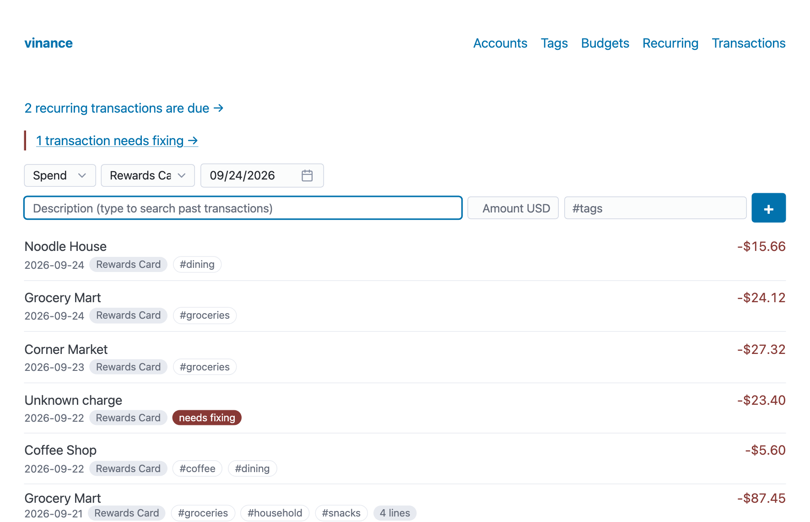
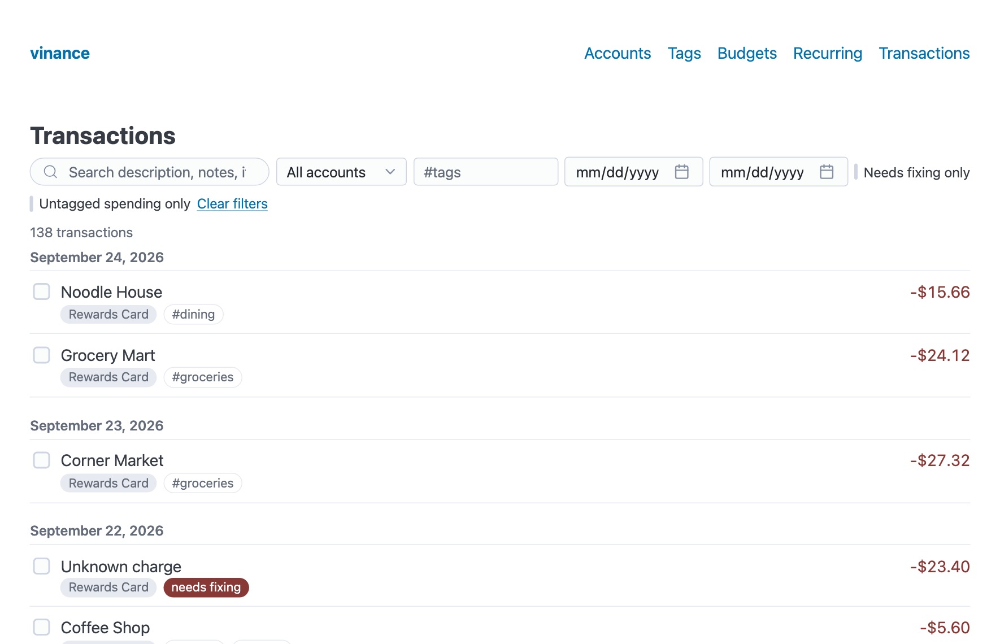
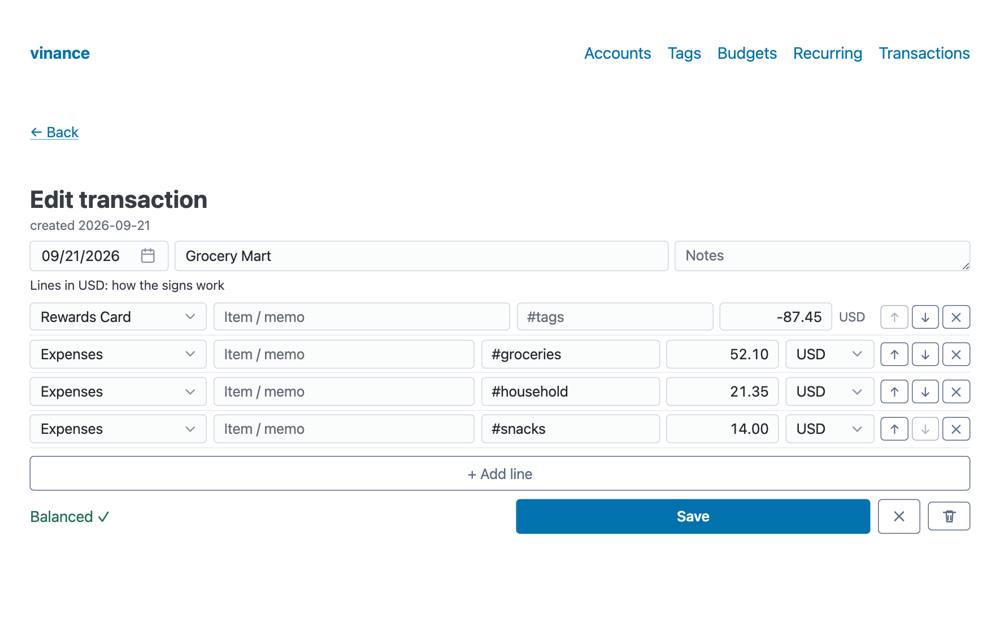
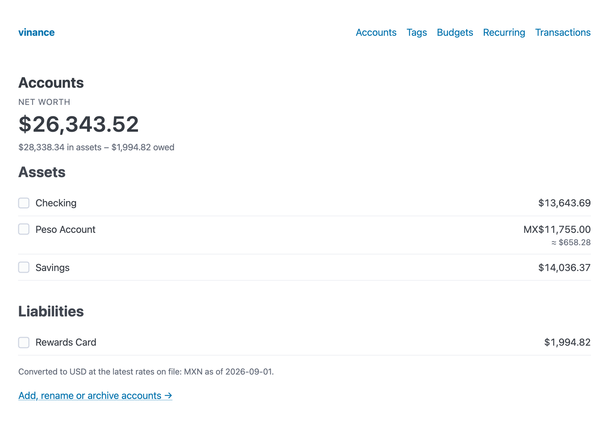
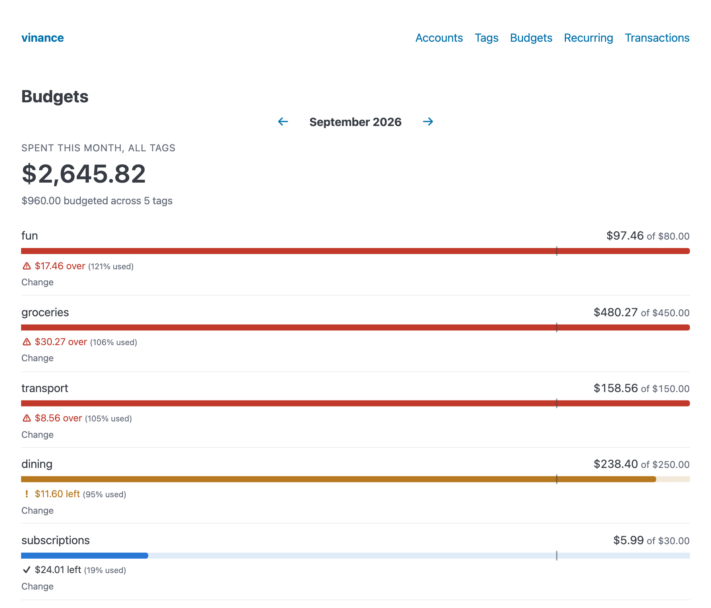
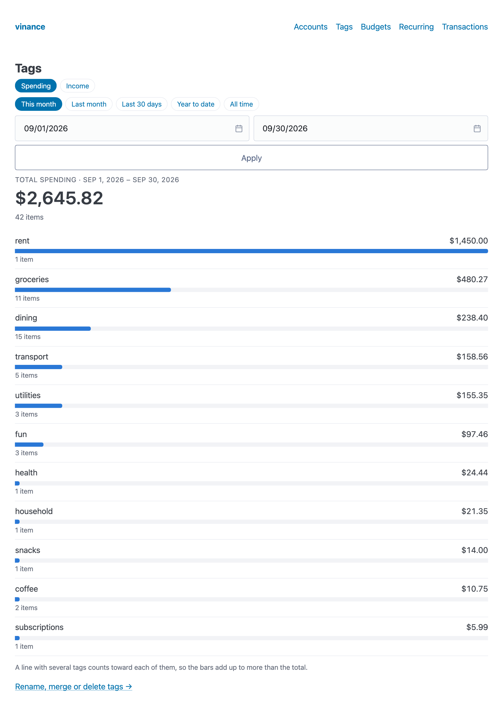
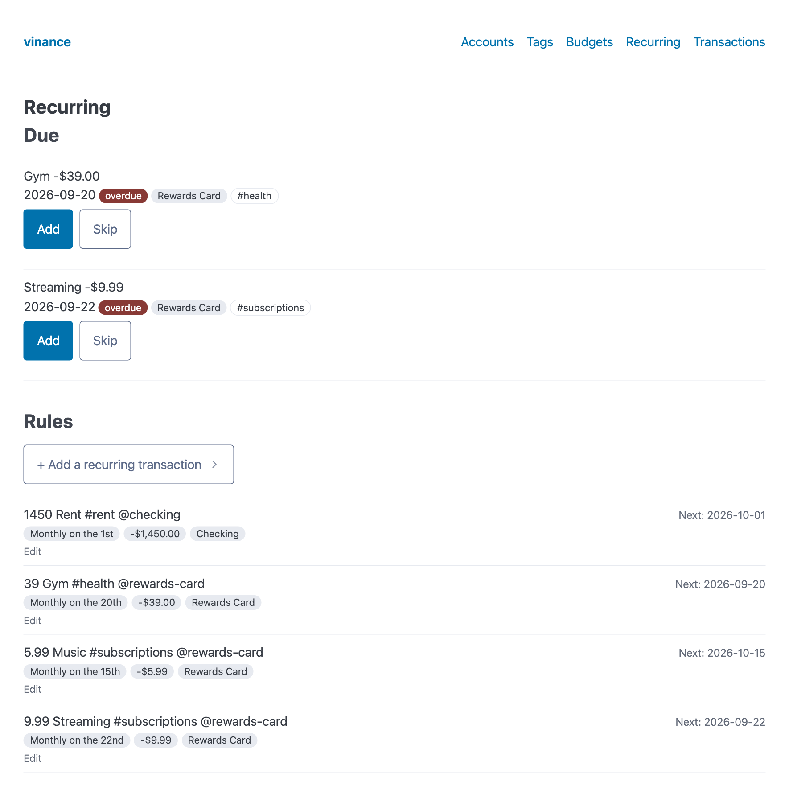

# vinance

[](https://github.com/amascii/vinance/actions/workflows/ci.yml)

A simple, fast personal finance tracker for one person: a lighter alternative to GnuCash that runs on your own machine.
Go + [chi](https://github.com/go-chi/chi) + [templ](https://templ.guide) + [htmx](https://htmx.org), with SQLite for storage.

> The screenshots below use invented demo data. Regenerate them with `make screenshots`.



## Contents

- [Features](#features)
- [Running it](#running-it)
- [Development](#development)
- [License](#license)

## Features

- **Fast entry.** One form for spending, income and transfers, with autocomplete from your past transactions that fills in the usual account, amount and tags.
- **Tags instead of expense categories.** Tag a line `#groceries #coffee`; reports and budgets sum by tag. A transaction can carry several.
- **Split transactions.** Break one statement line (a store receipt) into item lines, each with its own memo and tags. A live indicator shows what is still unallocated.
- **Double-entry under the hood.** Every transaction's splits sum to zero and the editor refuses to save one that doesn't, so balances always add up. Money booked to an Imbalance account shows up as "needs fixing" until you categorise it.
- **Multi-currency.** Each account has one currency; cross-currency transactions keep both the amount and the value. Balances and net worth are converted to USD with stored rates.
- **Budgets and recurring entries.** Monthly budgets per tag with an even-pace marker, and recurring rules that wait for you to Add or Skip each due occurrence (nothing is created behind your back).
- **Bulk tag editing, filters and search** across the whole history, with infinite scroll. Transactions are grouped under a heading for each day.
- **Money is exact.** Amounts are integer minor units end to end; there is no floating point anywhere near a balance.

| Transactions | Split editor |
|---|---|
|  |  |

| Accounts and net worth | Budgets |
|---|---|
|  |  |

| Spending by tag | Recurring |
|---|---|
|  |  |

## Running it

You need Go (see `go.mod` for the version). There is nothing else to install: SQLite is compiled in.

```sh
git clone https://github.com/amascii/vinance.git
cd vinance
make run          # http://127.0.0.1:8080
make run-lan      # same, but reachable from your phone/other computers on the same Wi-Fi (http://<your-lan-ip>:8080)
```

The database is created and migrated on first start at `./data/vinance.db`. `data/` is gitignored, so your numbers never end up in the repo.
Add your first account on the **Accounts → Add, rename or archive accounts** page, then use the form on the home page.

| Variable | Default | |
|---|---|---|
| `VINANCE_DB` | `./data/vinance.db` | SQLite file |
| `VINANCE_ADDR` | `127.0.0.1:8080` | listen address |
| `LOG_LEVEL` | `info` | `debug`, `info`, `warn`, `error` (logs are JSON) |

> **There is no login.** vinance is built for `localhost`. Don't expose it to a network you don't trust; if you want phone access, put it behind
> something that authenticates (for example Tailscale) first.

## Development

```sh
make test             # unit + HTTP feature tests
make e2e-install      # one-time: download Chromium for Playwright
make e2e              # browser journeys
make generate         # after editing *.templ or internal/db/queries/*.sql (generated code is committed)
make screenshots      # regenerate docs/screenshots from synthetic data
```

Tests use small synthetic fixtures only. [`PROJECT.md`](PROJECT.md) holds the design decisions, data model and task log;
[`CLAUDE.md`](CLAUDE.md) holds the working rules and hard-won gotchas.

## License

[MIT](LICENSE)
